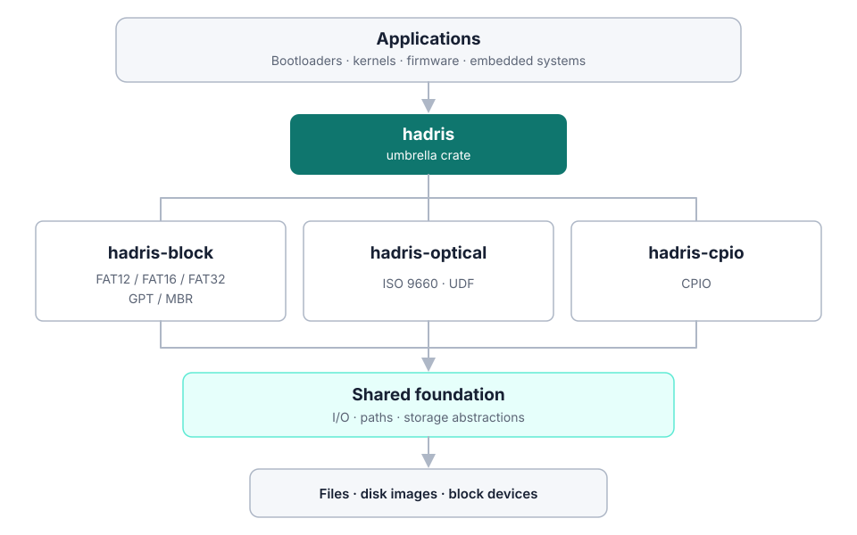

# Hadris

**The Rust storage stack.**

Hadris is a collection of pure Rust storage and filesystem libraries for block
devices, GPT and MBR partition tables, FAT12/16/32, ISO 9660, UDF, CPIO, and
disk images, plus an experimental read-only NTFS reader. It supports desktop
applications as well as `no_std` bootloaders, operating-system kernels,
firmware, and embedded devices.

Use a focused format crate such as `hadris-fat` or `hadris-iso`, a category
facade such as `hadris-block`, or the `hadris` umbrella crate as an application
grows. Shared I/O, storage, path, feature, and API conventions keep those
layers coherent without hiding format-specific capabilities.

## Stability and Versioning

Hadris follows [Semantic Versioning](https://semver.org/). The
release-candidate series completed the V2 feature and public-API freeze, and
`2.2.0` is the current stable release of that API. Within the `2.x` series,
breaking changes to the public API require a new major version; minor releases
add backward-compatible functionality, and patch releases are limited to
correctness fixes, interoperability qualification, and documentation.

The `unstable-exfat` preview and experimental `hadris-ntfs` reader are
explicitly outside this stability promise.
Stable FAT12/16/32, partition, ISO 9660, UDF, CPIO, facade, and storage APIs are
covered by the V2 public-API snapshots.

## Architecture



Hadris uses category-level detection and opening APIs while preserving the
concrete APIs of each filesystem. It does not force unlike formats behind one
lowest-common-denominator filesystem trait.

## Why Hadris?

- **Pure Rust** - Inspect, create, and modify storage formats without C library
  bindings.
- **`std`, `alloc`, and allocation-free configurations** - Select the platform
  support and capabilities appropriate for the target.
- **Bootloader and kernel friendly** - Read disk images and filesystems in
  freestanding environments.
- **Embedded ready** - Work with storage used by firmware, SD cards, and USB
  drives through portable I/O abstractions.
- **Desktop capable** - Build image parsers, filesystem tools, and optical-disc
  image generators with synchronous or asynchronous APIs.
- **One ecosystem** - Move from a leaf filesystem crate to category facades or
  the umbrella crate while retaining the same underlying implementations.

## Who is Hadris for?

- Bootloaders and UEFI or Open Firmware utilities reading FAT and ISO images
- Operating-system kernels and experimental filesystems
- Embedded firmware working with SD cards, USB storage, and raw block devices
- Desktop disk-image, recovery, inspection, and authoring tools
- Build systems producing initramfs, bootable ISO, UDF, or hybrid disc images

## Workspace Crates

Crates are grouped by their storage access model. These directories are
organizational only: published package names such as `hadris-fat` are unchanged.

### Core Libraries

- **[hadris-io](crates/core/hadris-io)** - No-std I/O abstraction layer (`Read`, `Write`, `Seek`)
- **[hadris-fixed](crates/core/hadris-fixed)** - Fixed-capacity byte, UTF-8, and endian-aware UTF-16 types
- **[hadris-path](crates/core/hadris-path)** - Allocation-free lexical paths for virtual filesystems and archives
- **[hadris-common](crates/core/hadris-common)** - Shared filesystem utilities (endian types, CRC, optical helpers)
- **[hadris-storage](crates/core/hadris-storage)** - Format-neutral block geometry, device traits, and seekable-stream adapters
- **[hadris-macros](crates/core/hadris-macros)** - Proc macros for dual sync/async code generation

### Block Storage

- **[hadris-block](crates/block/hadris-block)** - Category facade for storage traits, partitions, and block filesystems, with lightweight detection, bounded partition views, and unified FAT opening
- **[hadris-part](crates/block/hadris-part)** - Partition table support
  - MBR (Legacy BIOS partition tables)
  - GPT (Modern UEFI partition tables)
  - Hybrid MBR (Combined MBR+GPT for dual BIOS/UEFI boot)
- **[hadris-fat](crates/block/hadris-fat)** - FAT filesystem implementation
  - FAT12, FAT16, FAT32 support
  - Long filename support (VFAT/LFN)
  - FAT sector caching for performance
  - Analysis and verification tools
  - exFAT preview (unstable leaf-crate feature; not opened by the block facade)
- **[hadris-ntfs](crates/block/hadris-ntfs)** - Experimental read-only NTFS
  reader with sync/async and `no_std` support; currently a leaf crate rather
  than part of the stable block facade

### Optical Media

- **[hadris-optical](crates/optical/hadris-optical)** - Category facade with multi-format ISO/UDF/bridge detection and image composition
- **[hadris-iso](crates/optical/hadris-iso)** - ISO 9660 filesystem implementation
  - Allocation-free sync/async ISO 9660 and Joliet navigation with caller-buffered file streaming
  - ISO 9660 Level 1-3 and ISO 9660:1999 (long filenames)
  - Joliet extension (UTF-16 Unicode filenames)
  - Rock Ridge (RRIP) and SUSP (POSIX semantics, symlinks)
  - El-Torito bootable CD/DVD images
- **[hadris-udf](crates/optical/hadris-udf)** - Universal Disk Format (UDF) for DVD/Blu-ray
- **[hadris-cd](crates/optical/hadris-cd)** - Hybrid ISO+UDF optical disc image creation

### Archives

- **[hadris-archive](crates/archive/hadris-archive)** - Category facade for sequential archive formats
- **[hadris-cpio](crates/archive/hadris-cpio)** - CPIO newc/SVR4 archives (initramfs)

### CLI Tools

| Crate | Binary | Notes |
|-------|--------|-------|
| [hadris-iso-cli](crates/tools/hadris-iso-cli) | `hadris-iso` | ISO create/inspect/extract; legacy alias: `hadris-iso-cli` |
| [hadris-fat-cli](crates/tools/hadris-fat-cli) | `hadris-fat` | FAT create/read/extract/analyze; legacy alias: `fatutil` |
| [hadris-cpio-cli](crates/tools/hadris-cpio-cli) | `hadris-cpio` | CPIO create/read/extract; legacy alias: `cpioutil` |
| [hadris-udf-cli](crates/tools/hadris-udf-cli) | `hadris-udf` | UDF create/inspect/extract; legacy alias: `hadris-udf-cli` |
| [hadris-cd-cli](crates/tools/hadris-cd-cli) | `hadris-cd` | Create, inspect, and verify hybrid ISO 9660/UDF images |

### Meta-crate

- **[hadris](crates/core/hadris)** - Optional umbrella built on the three category facades, plus `fixed` and `path` utilities, with grouped APIs: `block::{storage, fat, part}`, `optical::{iso, udf, cd}`, and `archive::cpio`. Platform, I/O-mode, capability, leaf, and category features are forwarded independently; the hosted synchronous read/write configuration with `fixed`, `path`, `iso`, `fat`, and `cpio` is enabled by default. The hybrid `cd` writer is currently sync-only.

## Key Features

- **No-std compatible** - Use in bootloaders, kernels, firmware, and embedded systems
- **Allocation-free ISO reading** - Navigate ISO 9660/Joliet paths and stream
  multi-extent files with caller-owned buffers in sync or async builds
- **Configurable** - Feature flags for read-only, write support, and extensions
- **Dual sync/async** - Shared implementations via `hadris-macros`
- **Standards oriented** - ECMA-119, IEEE P1282 / Rock Ridge, El-Torito, Microsoft FAT, ECMA-167 / UDF, CPIO newc

## FAT Interoperability

Hadris-generated images are checked against an independent raw-image oracle
and common FAT implementations. These results cover the same filesystem
operations on every listed FAT variant. The oracle row counts the 18 peer
scenarios and the three geometry-sized limit exercises; its three open
failures per width are recorded library bugs (a refused case-only rename, an
invalid 8.3 alias for a name starting with two periods, and clusters leaked
when the volume fills).

| Consumer | FAT12 | FAT16 | FAT32 |
|----------|-------|-------|-------|
| Hadris specification oracle | 18/21 | 18/21 | 18/21 |
| mtools 4.0.49 reader | Pass (14/16) | Pass (14/16) | Pass (14/16) |
| dosfstools `fsck.fat` 4.2 | Pass (16/16) | Pass (16/16) | Pass (16/16) |
| Rust `fatfs` master (`2aefc2a`) reader | Pass (16/16) | Pass (16/16) | Pass (16/16) |
| macOS `fsck_msdos` | Pass (2/2) | Pass (2/2) | Pass (2/2) |

“Pass” means that the consumer read the expected semantic tree or that the
checker accepted the completed image; the two mtools read failures per width
are names outside the Basic Multilingual Plane, which mtools transliterates.
See the
[FAT compliance profile](docs/compliance/hadris-fat.md#interoperability-results)
for the test method, peer-writer conformance, and known tool defects.

## ISO Interoperability

Hadris-generated ISO images are checked against an independent ECMA-119
raw-image oracle and common ISO readers.

| Consumer | Result |
|----------|--------|
| Hadris specification oracle | Pass (2/2) |
| xorriso/libisofs 1.5.8 | Pass (2/2) |
| Linux kernel ISO driver | Pass (2/2) |
| macOS 26.6.2 built-in ISO reader | Pass (2/2) |
| Windows `Mount-DiskImage` | Available manual target; not yet measured |

See the [ISO compliance profile](docs/compliance/hadris-iso.md#consumers-of-hadris-images)
for the test method, peer-producer conformance, and known tool deviations.

## Quick Start

Choose the narrowest entry point that fits the application:

```toml
[dependencies]
# One filesystem:
hadris-fat = "2.2.0"

# Or the unified storage ecosystem:
hadris = { version = "2.2.0", features = ["block", "optical"] }
```

The umbrella crate re-exports the same underlying format crates through
`hadris::block`, `hadris::optical`, and `hadris::archive`, so applications can
grow into partition detection or additional disk-image formats without
replacing their filesystem implementation.

Each package now owns its version; all current packages target **2.2.0**:

```toml
[dependencies]
hadris-iso = "2.2.0"
hadris-fat = "2.2.0"
hadris-part = { version = "2.2.0", features = ["read"] }
hadris-fixed = "2.2.0"
hadris-path = "2.2.0"
```

For allocation-free `no_std` ISO reading:

```toml
[dependencies]
# No heap allocator: ISO 9660/Joliet lookup and streamed file reads.
hadris-iso = { version = "2.2.0", default-features = false, features = ["read", "sync"] }
hadris-fat = { version = "2.2.0", default-features = false, features = ["read", "sync"] }
```

Add the `alloc` feature to `hadris-iso` when owned collections, convenience
reads, and Rock Ridge metadata enrichment are needed without full `std`.

## Building

```bash
# Build entire workspace
cargo build --workspace

# Run tests
cargo test --workspace

# Build for no-std (example)
cargo build -p hadris-fat --no-default-features --features "read,sync"
```

See [CLAUDE.md](CLAUDE.md) for detailed build instructions and architecture notes, and [CONTRIBUTING.md](CONTRIBUTING.md) for PR workflow.
See the [`2.2.0` changelog](CHANGELOG.md#220---2026-08-24) for the current
release summary and the [`2.0.0` release notes](docs/hadris-2.0.0-release-notes.md)
for the V2 upgrade guide.
The Docusaurus source for the task-oriented documentation site lives in
[`website/`](website/); it includes getting-started, crate-selection, and
FAT, partition, ISO, CPIO, and `no_std` use-case guides.
Runnable application examples live in [`examples/`](examples/) and are compiled
as part of the Cargo workspace.

**MSRV:** Rust 1.88.0 (`rust-toolchain.toml` / workspace `rust-version`).

Fuzz harnesses under [`fuzz/`](fuzz/) are local developer tools and are **not** part of PR CI.

## Development

Install [pre-commit](https://pre-commit.com/) hooks once per clone (runs `cargo fmt` / `cargo clippy` before commits):

```bash
# brew install pre-commit   # or: pipx install pre-commit
pre-commit install
pre-commit install --hook-type pre-push   # also run clippy on push
```

## License

Licensed under the [MIT license](LICENSE-MIT).
