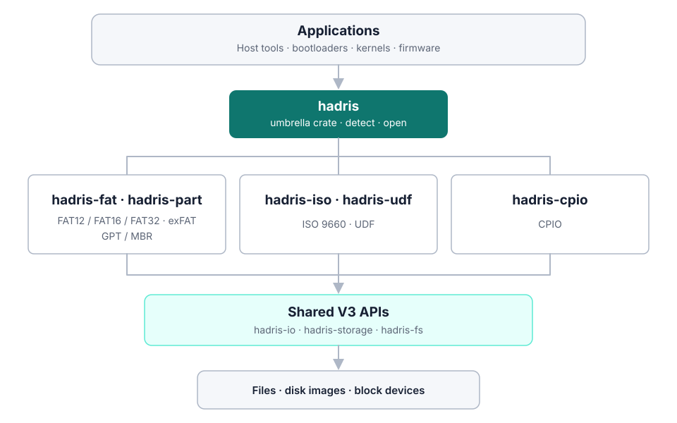

<p align="center">
  
</p>
<h1 align="center">Hadris</h1>
<p align="center">The Rust storage stack.</p>
<p align="center">
  <a href="rust-toolchain.toml"></a>
  <a href="https://github.com/hxyulin/hadris/actions/workflows/rust.yml"></a>
  <a href="https://github.com/hxyulin/hadris/actions/workflows/docs.yml"></a>
  <a href="LICENSE-MIT"></a>
</p>
<p align="center">
  <a href="https://hxyulin.github.io/hadris/">V3 documentation</a> ·
  <a href="examples/README.md">Examples</a> ·
  <a href="docs/hadris-3.0.0-migration.md">Migration guide</a> ·
  <a href="CHANGELOG.md">Changelog</a>
</p>

Read, inspect, edit and build filesystems and disk images in pure Rust. Hadris
supports hosted tools, bootloaders, kernels and embedded firmware, with `std`,
`alloc` and allocation-free configurations and synchronous or asynchronous I/O.
Use one format crate, or the umbrella crate to detect and open multiple formats
through a shared filesystem API.

**Release candidate:** V3 [3.0.0-rc.1](https://crates.io/crates/hadris/3.0.0-rc.1)
is published on crates.io, with development on `main`. **Stable:** V2 [2.5.0](https://github.com/hxyulin/hadris/tree/v2.5.0),
with maintenance on [`v2`](https://github.com/hxyulin/hadris/tree/v2).
The [migration guide](docs/hadris-3.0.0-migration.md) covers the API and CLI changes.

| Format | Read | Create or edit | Crate |
|---|---|---|---|
| FAT12, FAT16, FAT32 | Files, directories, VFAT long names | Edit, format, check | [hadris-fat](crates/block/hadris-fat) |
| exFAT | Files and directories | Edit, format, check | [hadris-fat](crates/block/hadris-fat) |
| ISO 9660 | Primary, Rock Ridge, Joliet and enhanced trees | Image authoring, sessions, El Torito and hybrid boot | [hadris-iso](crates/optical/hadris-iso) |
| UDF | Mastered volumes | Image authoring and ISO/UDF bridges | [hadris-udf](crates/optical/hadris-udf) |
| CPIO | newc, CRC, odc and old binary archives | Streaming newc, CRC and odc writers | [hadris-cpio](crates/archive/hadris-cpio) |
| MBR and GPT | Partition tables and recovery copies | Partition tables and whole-disk layouts | [hadris-part](crates/block/hadris-part) |
| NTFS and APFS | Preview readers | Read-only | [hadris-ntfs](crates/block/hadris-ntfs), [hadris-apfs](crates/block/hadris-apfs) |

## Quickstart

Install the V3 release-candidate CLI using Rust 1.88 or newer:

```sh
cargo install hadris-cli --version 3.0.0-rc.1 --locked
hadris --help
```

Inspect an existing image, or create one from a directory:

```sh
hadris detect disk.img
hadris fat ls disk.img
hadris iso create ./files -o image.iso --joliet --rock-ridge
hadris iso extract image.iso -o extracted
```

The `hadris` command has `fat`, `iso`, `udf`, `cpio`, `apfs` and `detect`
subcommands. `fat` handles FAT and exFAT; `udf bridge` authors hybrid optical
images. Image creation refuses an existing output unless `--force` is supplied;
extraction refuses to replace existing files.

For a self-contained source example that creates, detects and extracts FAT,
exFAT, ISO and UDF images in a temporary directory:

```sh
git clone https://github.com/hxyulin/hadris.git
cd hadris
cargo run --locked -p hadris-example-extract
```

<details>
<summary><strong>Use the Rust libraries</strong></summary>

V3 `3.0.0-rc.1` is available on crates.io.
One dependency reaches the format drivers and the shared I/O, device and
filesystem APIs. For a hosted FAT application:

```toml
[dependencies.hadris]
version = "3.0.0-rc.1"
default-features = false
features = ["std", "sync", "fat"]
```

Specify the prerelease version explicitly; `version = "3"` does not select RC1.
For development snapshots, use a Git dependency pinned to a reviewed `rev`.
Use `hadris::fat`, `hadris::fs`, `hadris::storage` and `hadris::io`; enabling
only `fat` does not add other formats. Add `write` for FAT formatting, or
`detect` and `part` for unknown/partitioned images. Individual crates remain
available when their versions and dependencies should be managed separately.

For allocation-free ISO reading use `features = ["sync", "iso"]`; for
allocation-free embedded FAT use `["sync", "fat"]`. Keep defaults disabled.
The shared FAT driver instead needs `["alloc", "sync", "fat"]` without `std`.

```sh
cargo run --locked -p hadris-example-migrate-v3
```

The [embedded guide](website/docs/guides/embedded.md) and
[firmware examples](examples/firmware) cover the APIs without an allocator.
For hosted use, [hadris-fs](crates/core/hadris-fs) provides `FileSystem`, `Volume`,
file handles and tree operations. The
[async guide](website/docs/guides/async-io.md) covers asynchronous use and explicit
close/sync. Add `alloc` to the ISO crate for image writing and sessions.

</details>

## Architecture



[hadris-io](crates/core/hadris-io) defines portable I/O;
[hadris-storage](crates/core/hadris-storage) supplies block devices, slices,
caching and read-ahead; [hadris-fs](crates/core/hadris-fs) supplies the shared
filesystem and image-tree APIs. Format crates retain their native operations,
and [hadris](crates/core/hadris) re-exports the stack with detection and opening.

Sync and `Send` async APIs share implementations generated by
[hadris-macros](crates/core/hadris-macros). The
[crate guide](website/docs/crates.md) explains package selection and features;
the [V3 design](docs/v3-api-design.md) records the API rules.

## Compatibility and qualification

Public API compatibility uses `cargo-semver-checks`, supported by feature-tier
builds, contract tests and the non-exhaustive lint. Format qualification uses
independent raw-image oracles and external implementations, including mtools,
dosfstools, xorriso, libarchive, udftools and native OS readers. See the
[FAT](docs/compliance/hadris-fat.md), [ISO](docs/compliance/hadris-iso.md) and
[UDF](docs/compliance/hadris-udf.md) profiles for results and coverage boundaries.

NTFS and APFS native APIs remain previews. Optional APFS software unlocking
uses the `encryption` feature; Apple-silicon hardware FileVault needs separate
support. [Known issues](KNOWN_ISSUES.md) document remaining correctness and
durability limits. [Performance measurements](docs/peer-performance.md) record
workload, I/O and memory tradeoffs rather than a universal speed claim.

## Contributing

[CONTRIBUTING.md](CONTRIBUTING.md) covers the toolchain, tests, CI and PR workflow.
Use the repository's Nix shell for external image tools and prek hooks:

```sh
nix develop
prek install
cargo test --workspace --locked
```

Runnable [examples](examples/README.md), the [tooling index](scripts/README.md)
and the [fuzz harness](fuzz/README.md) provide focused entry points.
Repository conventions for coding assistants are in [AGENTS.md](AGENTS.md).

## License

Hadris is available under the [MIT license](LICENSE-MIT).

The RC2 [async device migration guide](docs/async-devices.md) describes the
unified local/Send device contract and compatibility paths.
